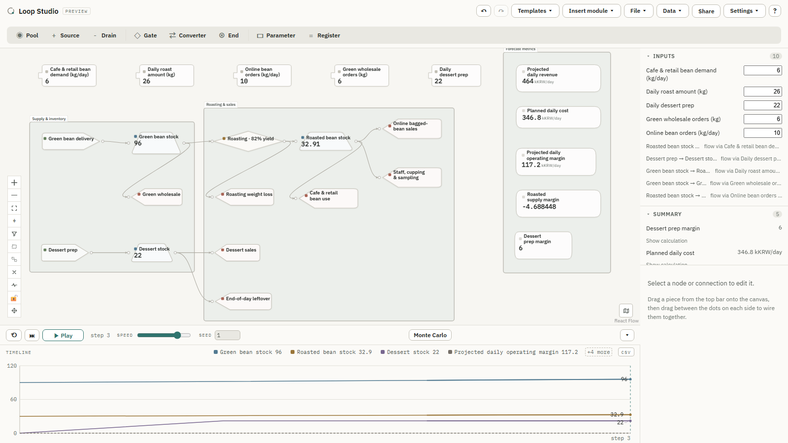
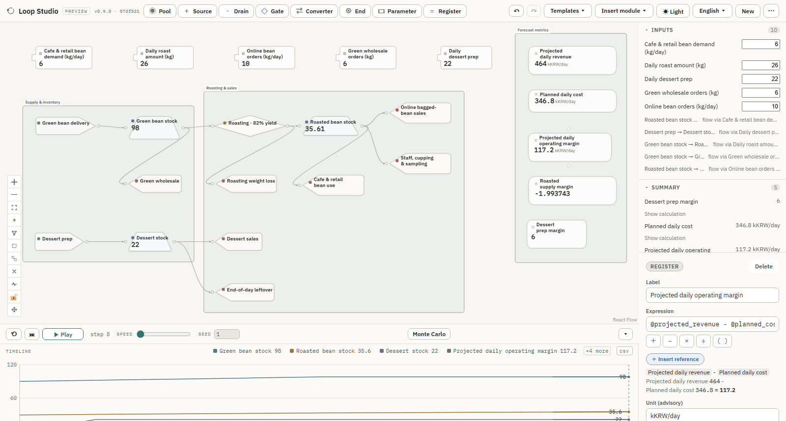
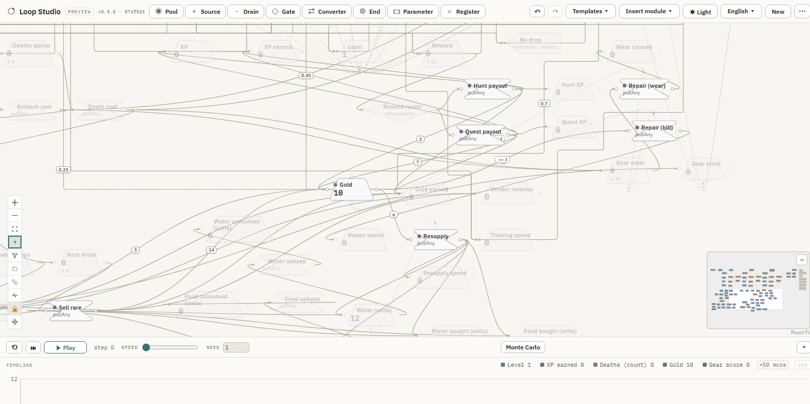

# Loop Studio




Loop Studio is a browser-based **visual systems editor and simulator** for
resource flows, state changes, probabilistic rules, and feedback loops. It is
designed primarily for **game economies**, while the same step-based model can
represent inventory and supply chains, production processes, service queues, cash
flows, energy systems, and other resource-flow systems. You draw the system as a
**Machinations-style diagram** — resources moving between pools, sources, drains,
gates, and converters — then run the model to see how it behaves over time.

Loop Studio currently uses a deterministic, discrete-step simulation model;
continuous-time equations and spatial physics are not directly supported (see
[Future directions](#future-directions)).

**Run it now — the live web app: <https://cozy-loop-studio.pages.dev>**

> Status: **working preview** — **v0.8.0**. The diagram editor and the
> simulation engine — deterministic,
> seeded randomness, Monte Carlo, and executable state connections (`trigger` /
> `activator` / `label`) — are all usable today, plus Workspace Export/Import,
> shareable `#g1=` links, an installable offline PWA, and file-based **project
> revisions & proposals** (`loop-revision/1`) for asynchronous collaboration.
> **v0.6.0** added a deterministic **model language** — `parameter` / `register`
> nodes and a safe arithmetic **expression** grammar (`loop-expr/1`,
> `loop-model/1`, `loop-revision/2`), Register `R(t)` observation, and an
> advisory `resourceType` tag — and a **Canvas Visual Refresh** (edge class /
> direction / cues, zoom detail levels, a tokenised direction marker,
> reduced-motion & forced-colors support). **New in v0.7.0:** automatic
> **orthogonal edge routing** — right-angle segments that step around nodes
> (`route: "orthogonal"`, `loop-revision/3`), a cosmetic wire field that changes
> nothing the engine computes (manual waypoint editing is deferred) — and
> **Simulation Playback / Event Choreography**: pressing Play makes resources
> visibly depart, travel the real edge path, and arrive before the value
> updates, on a shared per-step time axis, with reduced-motion / L0 / a11y /
> forced-colors handling and a bounded on-screen token count — a display layer
> that leaves the deterministic engine result untouched. Execution semantics are
> pinned down in frozen spec documents (see [Semantics](#semantics)).
>
> **New in v0.8.0:** three tracks —
>
> **Onboarding, part 2** — a **KO / EN localization** base (a runtime language
> switch on a single bundle; the chosen language is a `localStorage`-only UI
> setting that never enters the GraphDoc, Workspace, Share link, or
> `loop-revision/*` digest), full-app localization, a guided first-run tour, the
> *Early MMO progression* example, and **contextual inline help** — four
> situational, one-shot hints (an empty canvas, Monte Carlo's first open,
> Review's first open, Focus/Filter discovery) plus a `Contextual help`
> Help-menu entry — are all shipped.
>
> **Large-graph readability** ([`docs/large-graph-readability.md`](docs/large-graph-readability.md))
> — an engine-neutral readability / UI feature set: a global hit-test rule +
> 1-hop focus view, graph-derived filters, the `effective` / `evaluated` run
> distinction, manual group frames + an opt-in activity overlay, an explicit
> *Suggest frames* auto-clustering pass, and a five-preset frame accent colour.
> **Saved frames** make a manual or promoted frame's `id` / `label` / `rect` /
> `color` part of the document as a `loop-revision/5` **cosmetic** `frames`
> block ([`SEMANTICS-R5.md`](SEMANTICS-R5.md), Frozen): it round-trips reload /
> Export·Import / Share / Workspace / a Project revision, and it moves the
> `loop-revision/5` content digest and the `dirty` flag — but never the
> engine / structure digest or the simulation result.
>
> **Productization track** (design-first) — the settled *product direction*, a
> *template label overlay*, the *Coffee roastery operations flow* Template (the
> first bundled `loop-model/2` graph — a real **model-semantics** extension: a
> resource edge's `flow` may reference a Parameter's value, resolved once per
> step, not a cosmetic wire field), and example display-unit hints. The
> **small module / template-composition system**
> ([`docs/module-system.md`](docs/module-system.md), `MS`): impl PR 1 has
> shipped an **Insert module ▾** menu — insert any Graph JSON (a bundled
> Building block or a file) into the open graph with every id re-issued, one
> atomic undo, a v1 → v2 promotion consent gate, and **Extract selection as
> module…**. No file-format change (a module is a plain Graph JSON). Impl PR 2
> shipped the **Inputs / Summary panels** — every Parameter with an editable
> value and every Register with its value, unit and calculation, in the desktop
> right column, each row read-through to the canvas. **Dense-graph pan
> usability** ([`docs/dense-graph-pan.md`](docs/dense-graph-pan.md), `DGP`,
> real-phone verified) makes a packed graph pannable and pinch-zoomable even
> when there is no empty canvas left to grab.
>
> **Desktop-first editor.** Mobile browsers get a **view & run** layout —
> pan/zoom, play, Monte Carlo, inspect a node; editing (add / move / connect /
> delete) is desktop-only ([`docs/mobile.md`](docs/mobile.md)).

## Screenshots

**The model** — the Coffee roastery Template is a small operations-flow
economy: green beans arrive, get roasted (82 % yield), and leave as
café / retail / online / dessert sales, with five day-to-day Parameters
feeding five computed Register outputs (projected revenue, cost, operating
margin, roasted-bean supply margin, dessert-prep margin).



**Reading a large graph** — the *Early MMO progression* example has 97 nodes.
Select one, turn Focus on, and everything outside its one-hop neighbourhood
dims — nothing is hidden, so structure stays legible without losing context.



## Why

Game economies are the representative case: Machinations is a well-established
notation for them (Dormans & Adams, *Game Mechanics: Advanced Game Design*) and
a commercial SaaS. Loop Studio is an independent, client-only implementation with
portable files and no account lock-in — nothing is uploaded, the whole app runs
in your browser, and a graph is a plain JSON file you own — and the notation
generalises: a pool that fills and drains on probabilistic rules is a warehouse,
a queue, or a cash balance just as readily as a resource bar.

## Develop

```bash
npm install
npm run dev            # http://localhost:5173
npm run build          # -> dist/            static SPA, deploy anywhere
npm run build:portable # -> dist-portable/   single self-contained index.html (file://)
npm run lint
npm test               # vitest (engine + store unit tests)
npm run e2e            # Playwright browser end-to-end
npm run e2e:dist      # Playwright against the production build
npm run e2e:pwa       # Playwright against the PWA build (service worker, offline, update)
npm run build:pwa     # -> dist-pwa/          the PWA build (also emitted by the Cloudflare `main` build)
```

Requires **Node 22+** (`.nvmrc` pins `22`; `engines` requires `>=22.12.0`).

## Stack

- React + TypeScript + Vite
- [React Flow](https://reactflow.dev) (`@xyflow/react`) for the node canvas
- Zustand for graph + simulation state
- The simulation engine is a dependency-free TypeScript module (`src/engine/`),
  kept separate from the UI so its behaviour can be unit-tested against the
  frozen spec documents
- Monte Carlo runs on a Web Worker on a secure origin, with a cooperative
  main-thread fallback for `file://` / insecure origins
- `vite-plugin-singlefile` produces a portable, offline single-file build
- `vite-plugin-pwa` (Workbox) adds an installable service worker on the hosted
  build only — the portable build ships none
- Deployed on **Cloudflare Pages**; CI on **GitHub Actions** (`main` is
  protected — PR + green `checks` / `e2e` required)

## Semantics

Behaviour is frozen in versioned spec documents; a behavioural change means a new
spec id, never an edit to a frozen one.

| Doc | Spec id | Covers |
|---|---|---|
| [`SEMANTICS.md`](SEMANTICS.md) | — | Engine A: deterministic step / pull / push, gates, converters, conservation |
| [`SEMANTICS-B1.md`](SEMANTICS-B1.md) | `loop-rng/1` | seeded keyed RNG, random flow (`1-3`, `2D6`), probabilistic gates |
| [`SEMANTICS-B2.md`](SEMANTICS-B2.md) | `loop-mc/1`, `loop-mc-seed/1` | Monte Carlo: many runs, per-timestep bands, final-value distribution |
| [`SEMANTICS-S.md`](SEMANTICS-S.md) | `loop-state/1` | state connections: `trigger` (+ delay), `activator`, `label` — historical baseline |
| [`SEMANTICS-S2.md`](SEMANTICS-S2.md) | `loop-state/2` | current: inherits v1; changes only the `label` event report shape to `delta` + `clampAdjustment` |
| [`SEMANTICS-W.md`](SEMANTICS-W.md) | `loop-workspace/1` | Workspace Export/Import — an optional `workspace` extension on the graph doc (run config, MC result, view, verified sim snapshot) |
| [`SEMANTICS-U.md`](SEMANTICS-U.md) | `loop-share/1` | Shareable URL — a `#g1=` fragment carrying the graph doc (zlib-wrapped DEFLATE + base64url, 8 KiB cap); PWA notes in [`docs/pwa.md`](docs/pwa.md) |
| [`SEMANTICS-R.md`](SEMANTICS-R.md) | `loop-revision/1` | Project Revision / Proposal — an optional `project` key: a stable `projectId`, immutable `parentId`-chained revisions, `proposal` files carrying a full `base.content` snapshot, an id-keyed three-way diff, and `exact` / `divergent` / `unknown` apply (whole-proposal confirmed unless `exact`, or per-hunk). No accounts / server / sync. |
| [`SEMANTICS-X.md`](SEMANTICS-X.md) | `loop-expr/1` | Expression grammar & evaluation — a small deterministic arithmetic language (`+ - * /`, unary `-`, `( )`, finite literals, `@id` / `@{id}` node references); pure single-pass evaluation, `/0` and non-finite ⇒ an error; an AST-canonical text form for the `loop-revision/2` digest. Foundation for `loop-model/1`. |
| [`SEMANTICS-M.md`](SEMANTICS-M.md) | `loop-model/1` | Model language — `parameter` (a tuned numeric input) and `register` (a `loop-expr/1` readout, computed from the committed snapshot each step, stores nothing) node kinds, plus an advisory `resourceType` tag on pools / resource edges. Additive: a graph without them is byte- and digest-identical to `loop-revision/1`. Ripples into `loop-revision/2` (a wire-level v1/v2 discriminator; a new `advisory` field tag). |
| [`SEMANTICS-M2.md`](SEMANTICS-M2.md) | `loop-model/2` (+ `loop-revision/4`) | Parameter-driven inputs — in a **v2 document** (schema `loop-studio/graph/2`) a `resource` edge's `flow` may be a single `@id` parameter reference the engine resolves to that Parameter's `value` once per step. The model-semantics version rides `schema` (a pre-`loop-model/2` reader fail-closes on the unknown value); v1 → v2 promotion is explicit, user-action-only, one-way. The `loop-revision` / `loop-workspace` engine digests gain a trailing `modelSemantics: "loop-model/2"` discriminator (**v2 only** — every v1 digest is byte-identical), so a v2 graph and a byte-identical v1 graph hash differently, as their runs differ. Ratified as `loop-revision/4`. |
| [`SEMANTICS-R2.md`](SEMANTICS-R2.md) | `loop-revision/2` | Revision projection / diff / Apply extended for the `loop-model/1` layer — a syntactic per-graph v1/v2 predicate run on the *normalised* doc (inferred, never stored), two new `FIELDS_BY_KIND` rows + a trailing `resourceType`, the `advisory` field tag, a conservative-extension guarantee with a golden vector, "verify the v1 digest, then lift" ordering, a computed cross-version whole-Apply loss report, and bidirectional v1 ↔ v2 compare/Apply. `loop-workspace/1` stays v1. |
| [`SEMANTICS-R3.md`](SEMANTICS-R3.md) | `loop-revision/3` | Revision projection / diff / Apply extended for the **edge-routing** user-intent fields (`edge.data.route` + `waypoints`, from [`docs/edge-routing.md`](docs/edge-routing.md)) — two trailing `cosmetic` edge keys, a per-graph/per-side v3 predicate on the normalised doc with verify-own-projection-then-lift ordering, a conservative-extension golden (a v2 file's v3 digest == its v2 digest; the v2→v3→v2 round-trip is exact), a routing-only defensive-read quarantine, and lossless preservation of the routing *value* across Graph / Share / Project revision / Workspace-v1 round-trips. The **computed** path / `routeClass` / router cache are wire content in **no** projection. `loop-workspace/1` stays v1. |
| [`SEMANTICS-R5.md`](SEMANTICS-R5.md) | `loop-revision/5` | Revision projection / diff / Apply extended for the **saved group-frame block** — `GraphDoc.frames`, a graph-level array of `{ id, label, rect, color? }` labelled overlays with **no membership** (from [`docs/large-graph-readability-saved-frames.md`](docs/large-graph-readability-saved-frames.md)). One trailing `cosmetic` top-level key, emitted only when non-empty; a per-side v5 predicate with verify-own-projection-then-lift ordering; a conservative-extension golden (a ≤ v4 file's v5 digest == its ≤ v4 digest); a defensive read that drops a bad entry, never the graph. A `frames` change flips `dirty` and moves the `loop-revision/5` **content** digest, but **never** `engineAffecting` / `advisoryAffecting`, never the engine / structure digest, and never the simulation result; a *divergent* three-way `frames` conflict is counted in `nConf` — the count of revision conflicts to resolve before a whole Apply, not a count of engine conflicts. `loop-workspace/1` stays v1. |

## Project revisions & proposals

**File-based asynchronous collaboration** — no accounts, no server, no
real-time sync. A project moves between people only as JSON files you own.
([`SEMANTICS-R.md`](SEMANTICS-R.md); worked example under
[`examples/revision/`](examples/revision/README.md).)

1. **Create a Project revision** — `Export ▾ → Project revision` writes a graph
   file that also carries a stable `projectId` and this revision's lineage.
   Send it to a collaborator.
2. **Make a proposal** — they open it, choose `Export ▾ → Make a proposal`,
   edit the copy, and send the proposal file back. It carries a complete
   snapshot of the base, so the diff and apply are computable entirely offline.
3. **Review** — you `Import` the proposal. It opens a **non-destructive Review**
   panel (a bottom sheet on mobile): your graph, simulation, and undo history
   are untouched. It shows a three-way diff (`base` / `theirs` / `yours`), a
   classification (`exact` / `divergent` / `unknown`), and any structural
   conflicts.
4. **Apply** — either the **whole proposal** (replaces your graph; confirms
   unless your revision *is* the base) or **Choose changes** (per-hunk: pick
   individual adds / removes, resolve each conflicting field *take theirs* /
   *keep mine*; removing a node surfaces the incident edges to remove **or
   retarget**). Either way the result is one new local revision, one undo
   entry, and the sim reset to step 0 — a single Undo reverts everything. Apply
   writes no file; `Export ▾ → Project revision` afterward to persist it.

`meta.author` / `meta.title` / `meta.createdAt` in a shared file are
**self-reported and unverified** — the UI renders them muted, and no diff,
classification, or apply decision depends on them.

## Layout

| Path | What |
|---|---|
| `src/model/` | Graph data types, node factories, JSON load/save |
| `src/store/` | Zustand store — nodes, edges, selection, persistence, sim state |
| `src/components/` | Toolbar, canvas, inspector, custom node & edge views, Monte-Carlo dialog + charts |
| `src/engine/` | Simulation engine — deterministic step, RNG, Monte Carlo, state connections |
| `e2e/` | Playwright specs (app, portable `file://`, production build, PWA service worker, mobile view/run) |
| `examples/` | Importable graphs and verification fixtures — `risky-factory.json`, the Early MMO progression and Coffee roastery Templates (`mmo-progression.json` + `.ko.json`, `coffee-roastery.json`), Engine-B / State / model-verification / playback-choreography fixtures each with an oracle, and the revision golden vectors `revision/` (`loop-revision/1` base + proposals + apply oracle), `revision-v2/`, `revision-v3/`, `revision-v5/`. See [`examples/README.md`](examples/README.md) |

## Roadmap

- ✅ Diagram editor — add / connect / edit nodes, JSON import/export, autosave
- ✅ Deterministic engine (Engine A) — step / play / reset, single-run timeline
- ✅ Engine B — seeded RNG, random flows, probabilistic gates
- ✅ Monte Carlo — engine, dialog UI, percentile bands, result export/import
- ✅ Cloudflare Pages deployment + GitHub Actions CI + protected `main`
- ✅ Onboarding, part 1 — starter templates, Engine-B + State verification fixtures, Risky Factory example
- ✅ State connections (`loop-state/1` + `loop-state/2`) — **v0.3.0**
  - ✅ Trigger + delay
  - ✅ Activator + comparison conditions
  - ✅ Label modifier — value semantics `loop-state/1`, event report `loop-state/2`
  - ✅ Inspector fields + in-canvas pulse / tint / flash
- ✅ Onboarding, part 2 — **v0.8.0** ([`docs/localization.md`](docs/localization.md)) — the localization base, full-app localization, the guided first-run tour, the Early MMO example, and contextual inline help have all shipped
  - ✅ Extensible localization base — registry-driven N-language structure with EN + KO as the first shipped locales; runtime language menu, atomic catalog activation, ICU formatting, EN fallback, and `localStorage`-only locale persistence. Locale state never enters GraphDoc / Workspace / Share / revision / digest / undo / simulation state
  - ✅ Full-app localization + acceptance validation — Toolbar, Canvas, Inspector, Timeline, Templates, Import / Export, Share, revision, PWA, dialogs, errors, empty states, accessibility text, KO typography, desktop / mobile visual references, invariance tests, and CI guards for catalog parity and hardcoded UI strings
  - ✅ Guided first-run tour ([`docs/guided-tour.md`](docs/guided-tour.md)) — a read-only six-step overlay (desktop + a separate mobile script), a Welcome card on the first run (`localStorage`-only, never serialized), and a Help (`?`) menu with `Take a tour` + `About Loop Studio`
  - ✅ "Early MMO progression (levels 1–15)" example ([`docs/example-mmo-progression.md`](docs/example-mmo-progression.md)) — a shipped play-economy demo graph (three zone lanes, probabilistic combat with wins / setbacks / deaths, categorised loot, a gold economy with repair and resupply costs, a rising XP curve) as the third **Templates** entry, EN + KO; generalised, not game-specific, with by-construction accounting invariants and a tuned reach-15 window
  - ✅ Contextual inline help ([`docs/contextual-inline-help.md`](docs/contextual-inline-help.md), `CIH`) — fills the gap the guided tour deliberately left: four situational, one-shot hints — an empty canvas, Monte Carlo's first open, Review's first open, and Focus/Filter discovery once a graph passes the auto-frame threshold — each shown once and re-armable ("Show again next time") from a **`Contextual help`** entry now live in both Help surfaces (desktop `?` menu, mobile More → Help). A three-tier priority defers to an open Monte Carlo / Review hint first, then an existing large-graph notice, then its own discovery hints, with a short cooldown after the guided tour closes so nothing piles up. Not a docs site, not video, not an interactive tutorial; presentation-only, same contract as the tour (§GT12) — no GraphDoc / digest / undo / simulation effect
- ✅ Ship — **v0.4.0**
  - ✅ Workspace Export / Import (`loop-workspace/1`) — a graph file plus the run config, last distribution, timeline view, canvas, and a verified sim snapshot
  - ✅ Shareable URL (`loop-share/1`) — a `Share` button that copies a `#g1=` link carrying the whole diagram; opened links load defensively, always paused
  - ✅ Offline PWA — installable, works fully offline **once the service-worker install and precache complete** on the first online load; a `prompt`-style update bar, never an automatic reload ([`docs/pwa.md`](docs/pwa.md))
  - ✅ Mobile **view/run** layout — a small-screen layout to open, pan/zoom, and run a shared diagram; editing stays desktop-only ([`docs/mobile.md`](docs/mobile.md))
- ✅ Project Revision / Proposal (`loop-revision/1`, [`SEMANTICS-R.md`](SEMANTICS-R.md)) — **v0.5.0**
  - ✅ File-only async collaboration — a stable `projectId`, an immutable `parentId`-chained revision lineage, `proposal` files carrying a full `base.content` snapshot (diff + apply run offline)
  - ✅ Non-destructive Review — an id-keyed three-way diff, `exact` / `divergent` / `unknown` classification, desktop panel === mobile sheet
  - ✅ Whole-proposal Apply (confirmed unless `exact`) and per-hunk **selective Apply** — per-field `take theirs` / `keep mine`, node-removal dependencies resolved by removing **or retargeting** each incident edge, structural conflicts and invalid selections refused before anything changes
  - ✅ Atomic result — one new local revision, one undo entry, sim reset to step 0
  - ✅ Verification fixture + oracle ([`examples/revision/`](examples/revision/README.md))
  - No accounts / server / real-time sync
- ✅ Model language + Canvas Visual Refresh — **v0.6.0**
  - ✅ `parameter` / `register` node kinds + a safe arithmetic **expression** grammar (`loop-expr/1` [`SEMANTICS-X.md`](SEMANTICS-X.md), `loop-model/1` [`SEMANTICS-M.md`](SEMANTICS-M.md), `loop-revision/2` [`SEMANTICS-R2.md`](SEMANTICS-R2.md) — all frozen) — a Register's value `R(t)` is recomputed from the committed snapshot every step and stored nowhere; `/0`, a self / mutual cycle, an unknown ref, or a depends-on-invalid never halts the run
  - ✅ Register `R(t)` observation — Canvas, Inspector, and a dashed Timeline line (a real gap where `R(t)` is invalid, never bridged), all recomputed from the same `R(currentStep)`; a stepped Workspace still round-trips as `loop-workspace/1` (no `loop-workspace/2`)
  - ✅ Advisory `resourceType` tag on pools / resource edges — colour, icon, legend, Inspector mismatch warning; computation-neutral (a mismatch changes nothing that runs)
  - ✅ Canvas Visual Refresh — every node/edge on one visual grammar: **edge class / direction / cues + three zoom detail levels (L2/L1/L0) that elide only supplementary text + a renderer-owned tokenised direction marker + `prefers-reduced-motion` / `forced-colors` support**, locked by a committed pixel matrix. Edge **geometry is unchanged** — React Flow's Bézier path; orthogonal routing is **not** in this release ([`docs/visual-language.md`](docs/visual-language.md))
  - ✅ Verification fixture + oracle ([`examples/model-verification.json`](examples/README.md)) + desktop / mobile Import→Run→Timeline E2E
- ✅ Orthogonal edge routing — **v0.7.0** ([`docs/edge-routing.md`](docs/edge-routing.md), `loop-revision/3` [`SEMANTICS-R3.md`](SEMANTICS-R3.md) frozen)
  - ✅ Orthogonal auto routing — **Slice 1**: `route: "orthogonal"` selection + an automatic deterministic router (obstacle-avoiding A*, parallel-edge fan-out, rounded corners, L/Z fallback) + an atomic route-map that recomputes every orthogonal edge in one pass. `route` / `waypoints` are `loop-revision/3` **cosmetic** wire fields — projected / diffed / dirty-tracked, never engine- or advisory-affecting; a non-routing graph's digest is unchanged. Pure render concern (never edits `source` / `target` / handles)
- ☐ Manual waypoint editing — deferred; a separate future project. The `waypoints` wire contract is frozen and the auto router reads / writes existing waypoints losslessly, but the create / move / delete UI is not built; revisited only when there is real demand
- ✅ Simulation Playback / Event Choreography — **v0.7.0** ([`docs/simulation-playback.md`](docs/simulation-playback.md), a non-`frozen` design doc — no `loop-*/N` id): pressing Play makes the model move — departure → travel → arrival → value update along each real edge path, on a shared per-step time axis — while the engine result stays byte-for-byte deterministic and untouched (a display layer only, **no new engine oracle**)
  - ✅ Resource token choreography — `depart` → `travel` → `arrive` → `settle` on the exact rendered edge `d` (Bézier **and** orthogonal), Pause freezes / speed re-rates / discard removes; several transfers on one edge ⇒ one summed token + a capped `+N` breakdown
  - ✅ State-event choreography — a `trigger` bead rides the edge on its delivery step, an `activator` lands a target-side cue on the `arrive` beat (never travels), a signed `label` delta bead by sign; a state cue is never merged into the resource token and fires once per transition
  - ✅ Viewing conditions — `prefers-reduced-motion` (no travelling element, collapsed beats, no artificial wait), an L0 (`zoom < 0.45`) elision that keeps the ordered depart / path-pulse / arrive cues, background-tab freeze-and-recover, and a mobile view/run layout
  - ✅ Accessibility & `forced-colors` — one always-mounted polite live region announcing the committed run state; every cue distinguishable without hue by shape tells
  - ✅ Performance ceiling — one global `MAX_PLAYBACK_TOKENS_TOTAL = 60` budget across resource + `trigger` + `label` travelling cues, chosen deterministically and sorted once per transition; `MAX_PLAYBACK_TOKENS = 12` breakdown chips; an idle edge never re-renders on a τ frame
  - ✅ Reproducible demo fixture + QA checklist ([`examples/playback-choreography.json`](examples/README.md)) + `e2e/playback-fixture.spec.ts` + the acceptance matrix (`e2e/playback-*.spec.ts`)
  - ✅ Slower default playback (`v0.8.0`) — a fresh document's per-step beat starts near **1 s** (was ~0.6 s) so the node / edge changes are followable, with one extra slower stop; every faster stop is unchanged. Wall-clock only — the engine result, RNG, and Monte Carlo are untouched, and the speed is not persisted
- ☐ Scenario Compare — results per Parameter combination (save format, run budget, comparison basis, chart semantics). Its own spec-first project; not started
- ☐ Advanced Monte-Carlo worker-count setting
- ◐ Productization track — making the tool usable by a general planner, not only its author; a separate track from Onboarding. Design-first: each pass is its own doc and PR
  - ✅ Product direction ([`docs/product-direction.md`](docs/product-direction.md)) — the settled direction the passes below must not contradict: adjust-a-template / assemble-building-blocks as the default path with the blank canvas kept as an unchanged advanced one, the Example / Template / Building block editorial roles, one canvas with readability affordances first, surfaced inputs + a result Summary separated from the raw graph, and positioning as an experiment tool over a verified model. A direction doc only — no app code, no `src/` change, no wire change, no `loop-*/N`. Complete when the five decisions (§PD9) are settled; the doc is then revised only if a decision changes
  - ✅ Large-graph readability ([`docs/large-graph-readability.md`](docs/large-graph-readability.md)) — **v0.8.0**; an **engine-neutral** readability / UI feature set: no node re-layout, and no change to the engine, its digest, or any simulation result. Its one serialized addition is the Slice 5 `frames` block — a `loop-revision/5` **cosmetic** field that moves the revision content digest and the `dirty` flag but not the engine / structure digest.
    - ✅ Slice 1 — a global hit-test rule (a node beats an overlapping edge / badge with Focus off — the mis-click fix) and a selection-driven 1-hop focus view
    - ✅ Slice 2 — ephemeral **filters** that hide by edge class / resource type / node kind, every list built from the open graph (not a fixed palette), cleared on graph reload and Reset view
    - ✅ Slice 3 — the **run distinction**: a committed step marks a node `effective` (in `StepReport.fired`) or the lighter `evaluated` (in `activated` but not `fired`), read straight off the committed `StepReport`, node-only, flow-execution nodes only; always on, static, cleared with the run cues
    - ✅ Slice 4a — per-step (non-accumulating) run cues, an **opt-in activity overlay**, and **manual group frames** (a labelled rectangle drawn behind the nodes; no membership)
    - ✅ Slice 4b — **auto (suggested) frames**: an explicit *Suggest frames* pass clusters the graph into dashed labelled regions; editing one promotes it to a manual frame
    - ✅ Frame accent colour ([`docs/large-graph-readability-frame-colour.md`](docs/large-graph-readability-frame-colour.md)) — a five-preset accent palette. On a **manual or promoted** frame the `color` is saved with the frame (part of the Slice 5 `loop-revision/5` `frames` block, so it moves the revision digest); a **pure suggested** frame never carries one and is session-only
    - ✅ Slice 5 — **saved frames** ([`docs/large-graph-readability-saved-frames.md`](docs/large-graph-readability-saved-frames.md), `loop-revision/5` [`SEMANTICS-R5.md`](SEMANTICS-R5.md) Frozen): a manual or promoted frame's `id` / `label` / `rect` / `color` is document content — it round-trips reload / Export·Import / Share / Workspace / a Project revision, every create / rename / resize / recolour / delete / `Clear all` is one graph undo entry, and the revision three-way carries a `frames` hunk (`clean` / `noop` / `conflict`; a divergent conflict gates a whole Apply). It moves the `loop-revision/5` content digest and `dirty` but never the engine / structure digest or the simulation result. Merged in `3fe7072` and Production-verified
  - ◐ Small module / template-composition system ([`docs/module-system.md`](docs/module-system.md), `MS`) — the next pass now that large-graph readability is complete. **Design settled** (all seven §MS7 forks + the five §MS4a boundaries): a module is a **plain Graph JSON** — no new schema, no file kind, no serialized module metadata, so every existing file / digest is byte-for-byte unaffected
    - ✅ Impl PR 1 — module insert / extract (`v0.8.0`): an **Insert module ▾** menu (bundled Building blocks + *From file…*, no `#g1=`), **drag-to-insert** on the canvas, and **Extract selection as module…** (download). Insert re-issues **every** node/edge id, rewrites `register` expr `@ref` + v2 `@param` flow, validates the whole candidate first (nothing changes on failure), and is **one atomic undo entry** (ids + v2 promotion + inserted set + selection). A v1 host + v2 module shows a **promotion consent** dialog first (undoable — one Ctrl+Z reverts the model change and the insert together); saved frames and a module's `recommendedRunConfig` are never carried in (a pre-op notice states the frames exclusion). Desktop only. Two bundled blocks (`module-buffered-step`, `module-reward-split`); block node labels are English in every locale for v1
    - ✅ Impl PR 2 — the **Inputs** panel (every Parameter with an editable value; v2 `@param` flow edges as read-only pointers) + **Summary** panel (every Register with its `R(t)` value, `unit`, and a Show-calculation toggle). Two collapsible sections at the top of the desktop right column, above the Inspector; each row is **read-through** — a click selects the node and jumps the canvas to it; per-panel collapse is a `localStorage` UI preference — nothing else is persisted, filed, or digested. Desktop only. Production-verified on `cc0162a`
    - ☐ Later (§MS10) — a dedicated assembly screen, a connection auto-helper, collapsible composite nodes, and any serialized `role` / `surfacedInputs` / `ports` field
  - ✅ Dense-graph pan usability ([`docs/dense-graph-pan.md`](docs/dense-graph-pan.md), `DGP`) — **shipped, real-phone verified**. On a packed graph there is no empty canvas to grab, so panning used to be near-impossible (mobile especially; the minimap is only a secondary aid). A transparent pan-capture overlay handles it: a one-finger drag past ~8px pans even when it starts on a node, live on mobile always and on desktop behind a session-only Pan mode toggle. A shorter tap still selects a **node** — or, failing that, the **nearest edge** within ~14px — and opens the Inspector (§DGP-C1). Two-finger pinch zoom is computed by the overlay itself (a first cut handing it to React Flow's own pinch never actually zoomed on a real device — §DGP-C4); wheel / trackpad-pinch zoom (mouse) is forwarded untouched; edit gestures are byte-for-byte unchanged when Pan mode is off. Native OS gestures are not suppressed but never leave the overlay stuck (§DGP-C2). Independent of Focus / Filter / frames / Activity overlay / selection; no GraphDoc / digest / undo change. Was sequenced **before** contextual inline help
  - order settled ([`docs/product-direction.md`](docs/product-direction.md) §PD8): large-graph readability first (done — the read/select problem was already reproducible in the shipped Early MMO example, it is smaller in scope with lower serialization risk, and its focus/filter substrate is a dependency of the module system's assembly screen), then the small module / template-composition system
  - ✅ Template label overlay ([`docs/template-label-overlay.md`](docs/template-label-overlay.md)) — a shared **fresh-open** `nodeId → label` overlay so a bundled Template opens in the user's language from **one** English-canonical graph (no per-locale JSON copies). Applied once, on a menu open, current locale only; never re-translates an open / Imported / Shared / Workspace / autosaved document; `label` only (not ids / expr / `resourceType` / positions); a CI drift check for missing / stale entries. Templates 3 (MMO) and 4 (coffee) both open through it. No engine / schema / wire / save-format change
  - ✅ "Coffee roastery operations flow" Template ([`docs/example-coffee-roastery.md`](docs/example-coffee-roastery.md)) — a **simplified operating-flow simulation**, not an ERP or a real-time monitoring system: a small Graph JSON (~23 nodes, one-day step, buy green beans → roast → sell across cafe / retail / online + dessert) shipped as the **4th Templates entry** (`커피 로스터리 운영 흐름`), opens editable, EN canonical + KO through the label overlay. The **first bundled `loop-model/2` graph** (schema `loop-studio/graph/2`): its **five surfaced Parameters** are `@param` flow references the engine resolves once per step, so changing any one moves a real stock trajectory — and a Summary of **planning-proxy** Registers (projected daily revenue / cost / operating margin in `kKRW/day`, plus two signed stock-cover proxies), which are projections on the planned levers, not realised or accounting figures. An external comprehension check has run ([`docs/example-coffee-roastery.md`](docs/example-coffee-roastery.md) §CR11.5): the simplified flow, naming, and five levers were understood; a completed before/after explanation of each lever's result direction was not demonstrated, so the result is partial and real-operations suitability is not claimed. No engine / schema / wire change
  - ✅ Example display units — the money Registers above read `kKRW/day`; the Early MMO example's reporting Registers read `gold` / `items` / `units`, its clock Pool is `Elapsed steps` (a step count, not wall time), and its water / food Pools carry a `(units)` suffix. Advisory display hints only — no calculation, trajectory, or Timeline change
  - ✅ Template-load fit — opening a Template now re-fits the camera to the new graph instead of keeping the previous one's pan / zoom (desktop and the mobile More → Templates path). Render-only; a file / Workspace import and manual pan are untouched

## Future directions

Not on a committed schedule — directions the current model could grow toward,
recorded here so the scope boundary above is explicit rather than implied:

- Continuous-time models and numerical integration
- Region, grid, or network-based spatial models
- External-engine integration for specialized physics (rigid-body collision,
  fluids, particles)

## Releases

**v0.8.0 — Onboarding, part 2 & the Productization track.** Localization, the
guided first-run tour, the Early MMO example, and contextual inline help
complete Onboarding, part 2; large-graph readability, a small module /
template-composition system, dense-graph pan usability, and a first
`loop-model/2` Template complete this cycle's slice of the Productization
track. Two backward-compatible wire-contract extensions ship — `loop-model/2`
(a real **model-semantics** addition: a resource edge's `flow` may reference a
Parameter's value) and `loop-revision/5` (a **revision storage / comparison
contract** addition: saved frames) — neither changes what an existing graph
computes, and neither moves a document's digest unless it actually uses the
new capability.

- **Onboarding, part 2** — an N-language-extensible **localization** base
  shipping EN + KO (a runtime language menu; the chosen language is a
  `localStorage`-only UI setting, never in the GraphDoc / Workspace / Share /
  revision / digest / undo / simulation state), full-app translation with CI
  guards against catalog drift and hardcoded strings, a read-only **six-step
  guided first-run tour** (desktop + a separate mobile script), the **"Early
  MMO progression (levels 1–15)"** example as a third Template, and
  **contextual inline help**: four one-shot situational hints (an empty
  canvas, Monte Carlo's first open, Review's first open, Focus/Filter
  discovery past the auto-frame threshold), each re-armable ("Show again next
  time") from a `Contextual help` entry now on both Help surfaces, with a
  three-tier priority and a post-tour cooldown so nothing piles up.
- **Large-graph readability** ([`docs/large-graph-readability.md`](docs/large-graph-readability.md))
  — a global hit-test fix (a node beats an overlapping edge / badge) plus a
  selection-driven 1-hop focus view, ephemeral filters by edge class /
  resource type / node kind, the `effective` / `evaluated` run distinction
  read straight off the committed step result, manual **and** auto-suggested
  group frames with a five-preset accent colour, and **saved frames**
  (`loop-revision/5`, [`SEMANTICS-R5.md`](SEMANTICS-R5.md), Frozen) — a manual
  or promoted frame's `id` / `label` / `rect` / `color` becomes real document
  content that round-trips reload / Export·Import / Share / Workspace / a
  Project revision. It moves the `loop-revision/5` content digest and the
  `dirty` flag — never the engine or structure digest, and never the
  simulation result.
- **Small module / template-composition system** ([`docs/module-system.md`](docs/module-system.md))
  — an **Insert module ▾** menu (bundled Building blocks or a file) and
  **Extract selection as module…**, both desktop only: every id is
  re-issued, the whole candidate validates before anything changes, and a
  v1 → v2 promotion (when needed) is undoable together with the insert as one
  atomic step. A module is a plain Graph JSON — no new file kind, no
  serialized module metadata. Alongside it, desktop **Inputs** (every
  Parameter, editable) and **Summary** (every Register, with its value / unit
  / calculation) panels, each row read-through to the canvas.
- **The Coffee roastery operations flow Template** — the first bundled
  `loop-model/2` graph ([`SEMANTICS-M2.md`](SEMANTICS-M2.md), Frozen): a
  resource edge's `flow` may be a single Parameter reference the engine
  resolves once per step, so its five surfaced Parameters drive a real stock
  trajectory. `loop-model/2` and its digest ratification `loop-revision/4`
  are conservative extensions — a v1-only document's canonical content and
  digest are unchanged.
- **Dense-graph pan usability** ([`docs/dense-graph-pan.md`](docs/dense-graph-pan.md))
  — a pan-capture overlay (a drag past ~8px pans even starting on a node) and
  a self-computed two-finger pinch zoom make a packed graph pannable and
  zoomable on both desktop and mobile, real-phone verified; a short tap still
  selects a node or, failing that, the nearest edge.

**Known limitations in this release:** module **Insert** / **Extract** are
desktop only, with no mobile flow yet; a Graph or Workspace file re-saved by
an **older build** does not preserve fields it doesn't recognise (e.g.
`timelineSeries`) — there is no forward-compatible unknown-field passthrough.

**Scenario Compare**, an advanced Monte-Carlo worker-count setting, **manual
waypoint editing**, and the module system's later assembly-screen work are
deliberately *not* in this release; each remains its own future project.

**v0.7.0 — orthogonal routing & simulation playback.** Two render-layer
additions on top of the same engine — the deterministic simulation result and
every serialized byte are unchanged.

- **Automatic orthogonal edge routing** (`docs/edge-routing.md`, `loop-revision/3`
  [`SEMANTICS-R3.md`](SEMANTICS-R3.md) frozen) — `route: "orthogonal"` on an edge
  swaps its Bézier curve for right-angle segments from a deterministic
  obstacle-avoiding router (parallel-edge fan-out, rounded corners, L/Z
  fallback) and an atomic route-map that recomputes every orthogonal edge in one
  pass. `route` / `waypoints` are `loop-revision/3` **cosmetic** wire fields —
  projected, diffed and dirty-tracked, but never engine- or advisory-affecting;
  a graph that uses no routing has an unchanged content digest. **Manual
  waypoint editing** (the create / move / delete UI) is deliberately deferred —
  the wire contract is frozen and existing waypoints round-trip losslessly,
  revisited only on real demand.
- **Simulation Playback / Event Choreography** (`docs/simulation-playback.md`, a
  non-`frozen` design doc — no `loop-*/N`) — pressing Play makes the model move:
  a resource visibly departs its source, travels the **exact rendered edge `d`**
  (Bézier or orthogonal), arrives, and only then does the value update, on a
  shared per-step `τ` time axis. State events choreograph too — a `trigger` bead
  rides the edge on its delivery step, an `activator` lands a target-side cue on
  the `arrive` beat (it never travels), a signed `label` delta bead reads by
  sign — and a state cue is never merged into the resource token. It handles
  `prefers-reduced-motion` (no travelling element, collapsed beats, no
  artificial wait), an L0 (`zoom < 0.45`) elision that keeps the ordered
  depart / path-pulse / arrive cues, background-tab freeze-and-recover, a mobile
  view/run layout, an always-mounted polite a11y live region, `forced-colors`
  shape tells, and a bounded on-screen token count — one global
  `MAX_PLAYBACK_TOKENS_TOTAL = 60` budget across resource + `trigger` + `label`
  cues, chosen deterministically and sorted once per transition. It is a
  **display layer only**: Play / Pause / speed / Reset move no GraphDoc bytes,
  no `loop-revision/3` digest, no undo stack, no viewport, no edge `d`, and a
  choreographed Play commits exactly what a plain `advance()` run does — so
  there is **no new engine oracle**, only the reproducible
  [`examples/playback-choreography.json`](examples/README.md) demo + its QA
  checklist and the `e2e/playback-*.spec.ts` acceptance matrix.

**Scenario Compare** and **manual waypoint editing** are deliberately *not* in
this release; each is its own later project.

**v0.6.0 — model language & canvas visual refresh.** A small deterministic
modelling layer on top of the engine, and one visual grammar for the canvas.
Edge **geometry** and **Scenario Compare** are deliberately *not* in this
release.

- **Parameter & Register nodes** (`loop-expr/1` [`SEMANTICS-X.md`](SEMANTICS-X.md),
  `loop-model/1` [`SEMANTICS-M.md`](SEMANTICS-M.md)) — a `parameter` is a tuned
  numeric input; a `register` holds a `loop-expr/1` expression (`+ - * /`, unary
  `-`, `( )`, finite literals, `@id` / `@{id}` references) whose value `R(t)` is
  **recomputed from the committed snapshot each step and stored nowhere**. It
  reads on the Canvas, the Inspector, and as a dashed line in the Timeline
  (a gap where `R(t)` is invalid, never bridged). `/0`, a self / mutual cycle,
  an unknown reference, and a depends-on-invalid cascade each surface an error
  code and **never halt the run**. Registers have no ports; an edge to one is
  isolated on import with a warning.
- **Advisory `resourceType`** — a free-text tag on pools and resource edges
  (trim → NFC → ≤ 64 bytes), with a built-in palette + icon, a legend, and an
  Inspector **mismatch** note. Purely advisory: a mismatch changes nothing that
  runs, and the tag rides through Export / Import.
- **`loop-revision/2`** ([`SEMANTICS-R2.md`](SEMANTICS-R2.md)) — the revision
  projection / diff / Apply extended for the model layer: a syntactic v1/v2
  discriminator inferred from the normalised doc (never stored), an `advisory`
  field tag, and a conservative-extension guarantee — a graph with no model
  layer is byte- and digest-identical to `loop-revision/1`. `loop-workspace/1`
  stays v1.
- **Canvas Visual Refresh** ([`docs/visual-language.md`](docs/visual-language.md))
  — every node and edge on one "Vessel" grammar. The v0.6.0 scope is **edge
  class / direction / cues** and **information elision**, not edge geometry:
  three zoom detail levels (L2 / L1 / L0) that elide **only supplementary
  text** — role, edge class + direction, selection / focus, error flags, run
  cues and the accessible name survive at every level, and the node footprint
  is byte-identical across them; a renderer-owned tokenised direction marker
  (no more React Flow grey); a persistent static cue under
  `prefers-reduced-motion`; `forced-colors` support. **Edge paths stay on React
  Flow's Bézier route** — orthogonal routing is deferred. Locked by a committed
  `{light,dark} × {desktop,mobile} × {L2,L1,L0}` pixel matrix and a set of
  view-change invariants (a render never moves the GraphDoc, its digest, the
  undo stack, node geometry, edge routes, or the viewport).
- **Verification fixture** — [`examples/model-verification.json`](examples/README.md)
  + its oracle, re-derived by `test/model-verification.test.ts` and replayed by
  a desktop / mobile Import→Run→Timeline E2E; plus a `loop-workspace/1` v1
  round-trip check proving no `loop-workspace/2` is needed for the model layer.

**v0.5.0 — project revisions & proposals.** File-based **asynchronous
collaboration** (`loop-revision/1`, [`SEMANTICS-R.md`](SEMANTICS-R.md)) — **no
accounts, no server, no real-time sync**. A project moves between people only as
JSON files.

- **Project revision files** — `Export ▾ → Project revision` writes a graph doc
  that also carries a stable `projectId` and an immutable `parentId`-chained
  revision lineage.
- **Proposals** — `Export ▾ → Make a proposal` produces a file with a complete
  `base.content` snapshot, so the three-way diff and every apply are computable
  entirely offline from the proposal plus the recipient's open document.
- **Non-destructive Review** — importing a proposal opens a Review panel
  (a bottom sheet on mobile): the graph, simulation, and undo history are
  untouched. It shows an id-keyed three-way diff (`base` / `theirs` / `yours`),
  an `exact` / `divergent` / `unknown` classification, and any structural
  conflicts. Desktop and mobile use the same rules.
- **Whole-proposal Apply** — replaces the graph with the proposal's; lands with
  no prompt only when your revision *is* the base, otherwise it confirms and
  names the loss.
- **Selective (per-hunk) Apply** — pick individual adds / removes and resolve
  each conflicting field *take theirs* / *keep mine*. Removing a node surfaces
  its incident edges, each resolved by removal **or endpoint retarget**; an
  invalid selection (an edge left pointing at nothing, a node blocked by a
  locally-added edge) is refused before anything changes, and a full-GraphDoc
  check runs on the result.
- **Atomic** — either path yields one new local revision (`parentId` = your
  pre-apply revision), one undo entry, and the sim reset to step 0; a single
  Undo restores the graph and the revision header together. Apply writes no
  file.
- `meta.author` / `meta.title` / `meta.createdAt` in a shared file are
  **self-reported and unverified**; no diff, classification, or apply decision
  depends on them.
- A worked end-to-end fixture with an apply oracle lives under
  [`examples/revision/`](examples/revision/README.md).

**v0.4.0 — ship: workspace, links, offline, mobile view/run.** Four additions
around the existing editor + engine:

- **Workspace Export / Import** (`loop-workspace/1`,
  [`SEMANTICS-W.md`](SEMANTICS-W.md)) — an optional `workspace` key on the graph
  file carrying the run config, the last completed Monte-Carlo distribution
  (bound to its graph by a semantic digest), the timeline view, the canvas
  viewport, and a verified simulation snapshot. 8 MiB cap, all-or-nothing, no
  silent truncation; restore is atomic and always paused.
- **Shareable URL** (`loop-share/1`, [`SEMANTICS-U.md`](SEMANTICS-U.md)) — a
  `Share` button that copies a `#g1=<payload>` link (zlib-wrapped DEFLATE +
  strict base64url, 8 KiB cap, graph only) built on the fixed public origin.
  Opening a link validates fully before touching state, confirms before
  replacing a modified graph, and strips the fragment.
- **Installable offline PWA** ([`docs/pwa.md`](docs/pwa.md)) — a
  `vite-plugin-pwa` service worker precaches the whole app shell; after the
  first online load completes, the app runs fully offline. Updates surface a
  dismissible bar and apply only on the user's click (one reload, never
  automatic). Registered only on the production host; the portable `file://`
  build ships no service worker.

- **Mobile view/run layout** ([`docs/mobile.md`](docs/mobile.md)) — below a
  720px (or landscape-short) breakpoint the app switches to a small-screen
  layout: a full-bleed canvas with finger pan / pinch-zoom, a fixed bottom bar
  (Reset / Step / Play / Monte Carlo), a collapsible Timeline sheet, a
  read-only Inspector sheet, and Share / Import / Export / Templates / Theme in
  a `More` menu. Structural editing is locked; opening a phone browser never
  mutates the diagram. The desktop layout is unchanged above the breakpoint.

**Scope of the mobile layer.** It is a **view & run** mode, not a second
editor. There are no accounts and no cloud projects, so a diagram moves between
devices exactly two ways: a **Graph JSON / Workspace JSON** file (`Export ▾` on
desktop → `More → Import file` on the phone; a Workspace file also restores the
run position, the last distribution, and the view), or a **`#g1=` Share link**
(graph only). Each browser's autosave is local to that browser and does not
sync across devices. Asynchronous collaboration (shared project revisions /
proposals) is **not** part of `v0.4.0` — it is a separate, spec-first candidate
for a later release.

**v0.3.0 — executable state connections.** State edges (`trigger` with an
integer `delay`, AND-combined `activator` level gates, `label` Pool modifiers)
now run as a Phase 0 at the top of every step — frozen as `loop-state/1`, with
the `label` event-report shape frozen separately as `loop-state/2`
([`SEMANTICS-S.md`](SEMANTICS-S.md), [`SEMANTICS-S2.md`](SEMANTICS-S2.md)). The
Inspector edits each mode with live validation; the canvas shows a travelling
pulse on a trigger's delivery step, a steady tint for an open activator, and a
`delta` flash (plus a separate clamp note) for a label. Covered end-to-end by
`examples/state-verification.json` and its committed trace.

v0.2.0 shipped Engine B (seeded RNG, probabilistic gates) and the Monte-Carlo
engine + UI.

## Credits

Created by Hanrim · [Cozy Shelter](https://cozyshelter.tistory.com/).

Loop Studio is an independent project and is not affiliated with or
endorsed by Machinations.io. Its modeling approach is informed by
publicly documented academic work on game-economy diagrams.

## Copyright

Copyright © 2026 Hanrim. All rights reserved.
