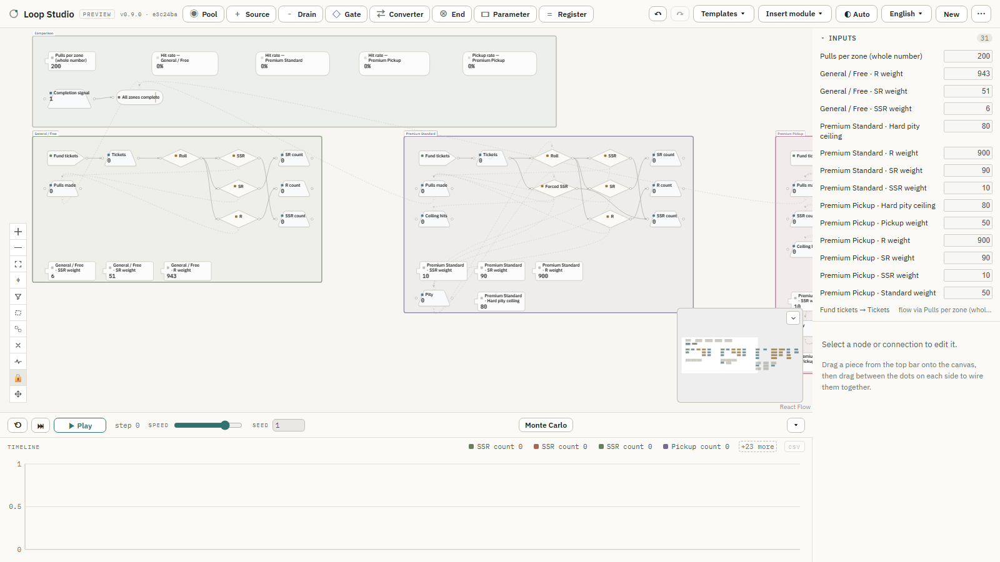
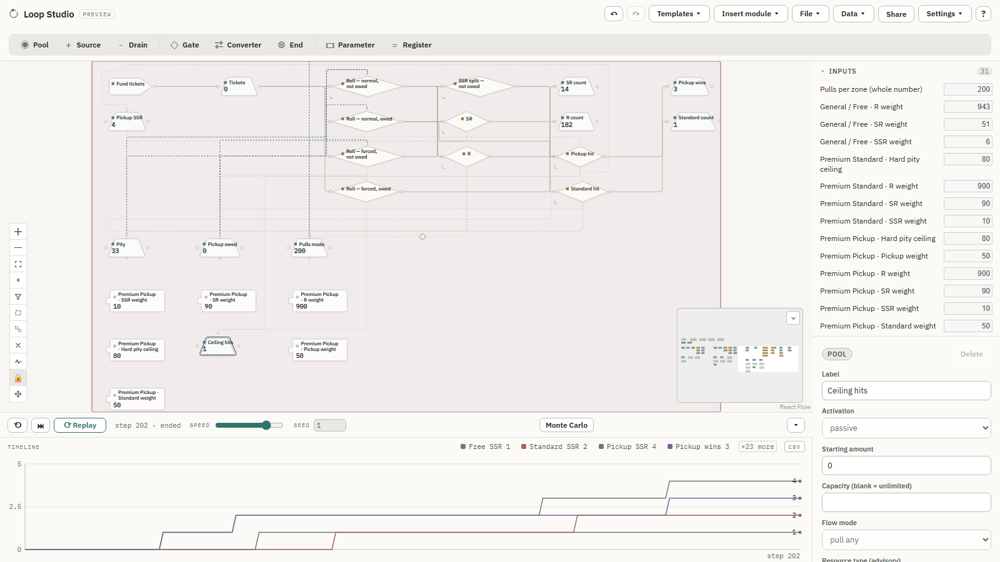

# Loop Studio

Loop Studio is a browser-based **visual systems editor and simulator** —
draw a Machinations-style diagram of pools, sources, drains, gates, and
converters, then run a deterministic, seeded simulation to see how the
system behaves over time. Built primarily for **game economies**, the same
step-based model generalises to inventory/supply chains, service queues,
cash flows, and other resource-flow systems; it's an independent, client-only
implementation — nothing is uploaded, the whole app runs in your browser, and
a graph is a plain JSON file you own.

**Run it now: <https://cozy-loop-studio.pages.dev>** — available in English,
한국어, and 日本語, with five bundled Templates ranging from a small
production flow to a large game economy and a three-zone probability/pity
comparison.


## Key features

- **Visual diagram editor** — pools, sources, drains, gates, and converters;
  resources move between them on a deterministic, discrete-step simulation
- **Seeded RNG + Monte Carlo** — probabilistic gates and flows, and
  many-run outcome distributions with percentile bands
- **A small model language** — `parameter` / `register` nodes with a safe
  arithmetic expression grammar, guided `@`-autocomplete authoring, and a
  name-and-value read-back
- **Executable state connections** — `trigger` (+ delay), `activator`, and
  `label` Pool modifiers, with in-canvas pulse / tint / flash feedback
- **Simulation playback** — resources visibly depart, travel the real edge
  path, and arrive before values update, in dependency order
- **Data import & collaboration** — spreadsheet data import with manual
  refresh and a three-way diff, plus file-based project revisions &
  proposals for asynchronous collaboration — no accounts, no server
- **Runs anywhere** — an installable offline PWA, a portable single-file
  build, shareable links, and a localized UI (EN / KO / JA)

## Representative use cases

The *3-zone gacha banner comparison* Template runs three pity/pickup rule
sets — **General/Free**, **Premium Standard** (hard-pity ceiling), and
**Premium Pickup** (hard-pity + a pickup guarantee) — side by side, 200 pulls
per zone under identical run settings. Once a run completes, its hit and
pickup rates are easy to compare; run Monte Carlo analysis to inspect the
distribution across many runs.



*Premium Pickup, framed on its own* — the hard-pity counter forces the next
roll's SSR once it hits the ceiling; whether that (or any ordinary) SSR lands
as pickup or standard depends on the `Pickup owed` guarantee flag, which a
miss sets and the next SSR consumes.



## Develop locally

```bash
npm install
npm run dev             # http://localhost:5173
npm run build            # -> dist/            static SPA, deploy anywhere
npm run build:portable   # -> dist-portable/   single self-contained index.html (file://)
npm run lint
npm test                 # vitest (engine + store unit tests)
npm run e2e              # Playwright browser end-to-end
```

Requires **Node 22+** (`.nvmrc` pins `22`). React + TypeScript + Vite,
[React Flow](https://reactflow.dev) for the canvas, Zustand for state; the
simulation engine is a dependency-free, unit-tested TypeScript module kept
separate from the UI. Deployed on Cloudflare Pages; CI on GitHub Actions.

## Technical reference

Behaviour is frozen in versioned spec documents; a behavioural change means a
new spec id, never an edit to a frozen one.

- **Engine & simulation** — [`SEMANTICS.md`](docs/specs/SEMANTICS.md), [`SEMANTICS-B1.md`](docs/specs/SEMANTICS-B1.md) (seeded RNG), [`SEMANTICS-B2.md`](docs/specs/SEMANTICS-B2.md) (Monte Carlo)
- **State connections** — [`SEMANTICS-S4.md`](docs/specs/SEMANTICS-S4.md) (`trigger` / `activator` / `label`; the latest of a sequential S1→S4 series, each frozen on its own)
- **Model language & expressions** — [`SEMANTICS-X.md`](docs/specs/SEMANTICS-X.md), [`SEMANTICS-M2.md`](docs/specs/SEMANTICS-M2.md) (the latest of a sequential M1→M2 series)
- **File formats & revisions** — [`SEMANTICS-W.md`](docs/specs/SEMANTICS-W.md) (Workspace), [`SEMANTICS-U.md`](docs/specs/SEMANTICS-U.md) (Share links), [`SEMANTICS-R8.md`](docs/specs/SEMANTICS-R8.md) (revision projection/diff/Apply — the latest of a sequential R1→R8 series)

**Project revisions & proposals** — a worked, file-based walkthrough of the
create → propose → review → apply flow lives in
[`examples/revision/README.md`](examples/revision/README.md).

**Where the model could grow** (not on a committed schedule — continuous-time
models, spatial/grid models, external-engine integration for specialized
physics) is recorded in [`docs/product-direction.md`](docs/product-direction.md).

Additional feature-specific design documents (localization, mobile, module
system, large-graph readability, simulation playback, edge routing, data
import, …) live under [`docs/`](docs/).

## Latest — v0.10.0

- **Spreadsheet data import** — paste or upload linked CSV/TSV tables;
  values materialize as Parameter nodes, with manual refresh, a three-way
  diff, and a change-proposal export
- **3-zone gacha banner comparison** — a fifth bundled Template comparing
  three pity/pickup rule sets under one Monte Carlo run
- **`@parameter` activator references** and **conditional post-pull state
  updates** — tunable activator thresholds and a label that can apply right
  after a step's pull, conditioned on what actually fired, both
  Inspector-driven
- **Desktop two-tier toolbar** — project/app commands on one row, the node
  palette on its own, with File/Data/Settings reorganized

**v0.10.1 (patch)** — Project revision / proposal files of a `@parameter`
document are written with the right model-version envelope, and files
exported by v0.10.0 are recovered on import.

See [`CHANGELOG.md`](CHANGELOG.md) for the full v0.10.0 / v0.10.1 notes and
every earlier release.

## Credits

Created by Hanrim · [Cozy Shelter](https://cozyshelter.tistory.com/).

Loop Studio is an independent project and is not affiliated with or
endorsed by Machinations.io. Its modeling approach is informed by
publicly documented academic work on game-economy diagrams.

## Copyright

Copyright © 2026 Hanrim. All rights reserved.
