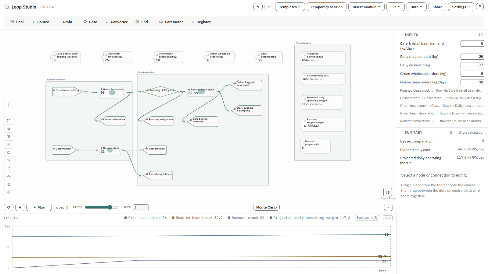

# Loop Studio

Loop Studio is a browser-based **visual systems editor and simulator** —
draw a Machinations-style diagram of pools, sources, drains, gates, and
converters, then run a deterministic, seeded simulation to see how the
system behaves over time. Built primarily for **game economies**, the same
step-based model generalises to inventory/supply chains, service queues,
cash flows, and other resource-flow systems; it's an independent, client-only
implementation — nothing is uploaded, the whole app runs in your browser, and
a graph is a plain JSON file you own. Work is kept in your browser profile
only when you say it is your own browser; on a shared computer a temporary
session reads nothing stored and stores nothing
([docs/storage-sessions.md](docs/storage-sessions.md)).

**Run it now: <https://cozy-loop-studio.pages.dev>** — available in
[18 languages](#languages), with five bundled Templates ranging from a small
production flow to a large game economy and a three-zone probability/pity
comparison.



## Key features

- **Visual diagram editor** — pools, sources, drains, gates, and converters;
  resources move between them on a deterministic, discrete-step simulation;
  select a region of nodes from the rail and move them together, or place nodes
  in a named frame that moves with its contents
- **Seeded RNG + Monte Carlo** — probabilistic gates and flows, and
  many-run outcome distributions with percentile bands
- **A small model language** — `parameter` / `register` nodes with a safe
  arithmetic expression grammar, guided `@`-autocomplete authoring, and a
  name-and-value read-back
- **Executable state connections** — `trigger` (+ delay), `activator`, and
  `label` Pool modifiers, with in-canvas pulse / tint / flash feedback
- **Simulation playback** — resources visibly depart, travel the real edge
  path, and arrive before values update, in dependency order
- **Data import & collaboration** — bring the numbers you already keep in a
  spreadsheet (CSV/TSV paste or upload) in as adjustable Parameters, with a
  manual refresh and a three-way diff — see [`docs/import-guide.md`](docs/import-guide.md);
  plus file-based project revisions & proposals for asynchronous
  collaboration — no accounts, no server
- **Runs anywhere** — an installable offline PWA, a portable single-file
  build, shareable links, and a UI translated into
  [18 languages](#languages)

## Languages

<!-- LOCALES:BEGIN — the codes in this table are checked against the locale
     registry by `src/i18n/readmeLocales.test.ts`. Adding or removing a shipped
     language must update this table in the same change. -->

The UI ships in 18 languages, listed here the way the in-app picker orders
them. Pick one under **Settings → Language**; the first visit follows your
browser's language, and the choice is remembered on that device.

| Code | Language | In its own words |
|---|---|---|
| `ar` | Arabic | العربية |
| `zh-Hans` | Chinese (Simplified) | 简体中文 |
| `zh-Hant` | Chinese (Traditional) | 繁體中文 |
| `nl` | Dutch | Nederlands |
| `en` | English | English |
| `fr` | French | Français |
| `de` | German | Deutsch |
| `it` | Italian | Italiano |
| `ja` | Japanese | 日本語 |
| `ko` | Korean | 한국어 |
| `pt-BR` | Portuguese (Brazil) | Português (Brasil) |
| `pt-PT` | Portuguese (Portugal) | Português (Portugal) |
| `ru` | Russian | Русский |
| `es-419` | Spanish (Latin America) | Español (Latinoamérica) |
| `es-ES` | Spanish (Spain) | Español (España) |
| `th` | Thai | ไทย |
| `tr` | Turkish | Türkçe |
| `vi` | Vietnamese | Tiếng Việt |

<!-- LOCALES:END -->

Regional pairs are separate locales, not one catalog with a flag: a browser
asking for `pt-PT` gets European Portuguese, while `pt`, `pt-BR` and the
African Portuguese tags get Brazilian — and the same split holds for the two
Spanish and the two Chinese catalogs. See
[`docs/localization.md`](docs/localization.md) for the resolution order and
the per-locale notes.

## Representative use cases

The *3-zone gacha banner comparison* Template runs three pity/pickup rule
sets — **General/Free**, **Premium Standard** (hard-pity ceiling), and
**Premium Pickup** (hard-pity + a pickup guarantee) — side by side, 200 pulls
per zone under identical run settings. Once a run completes, its hit and
pickup rates are easy to compare; run Monte Carlo analysis to inspect the
distribution across many runs.


*Premium Pickup, framed on its own* — the hard-pity counter forces the next
roll's SSR once it hits the ceiling; whether that (or any ordinary) SSR lands
as pickup or standard depends on the `Pickup owed` guarantee flag, which a
miss sets and the next SSR consumes.


## Develop locally

```bash
npm install
npm run dev             # http://localhost:5173
npm run build            # -> dist/            static SPA, deploy anywhere
npm run build:portable   # -> dist-portable/   single self-contained index.html (file://)
npm run lint
npm test                 # vitest (engine + store unit tests)
npm run e2e              # Playwright browser end-to-end
```

Requires **Node 22+** (`.nvmrc` pins `22`). React + TypeScript + Vite,
[React Flow](https://reactflow.dev) for the canvas, Zustand for state; the
simulation engine is a dependency-free, unit-tested TypeScript module kept
separate from the UI. Deployed on Cloudflare Pages; CI on GitHub Actions.

## Technical reference

Behaviour is frozen in versioned spec documents; a behavioural change means a
new spec id, never an edit to a frozen one.

- **Engine & simulation** — [`SEMANTICS.md`](docs/specs/SEMANTICS.md), [`SEMANTICS-B1.md`](docs/specs/SEMANTICS-B1.md) (seeded RNG), [`SEMANTICS-B2.md`](docs/specs/SEMANTICS-B2.md) (Monte Carlo)
- **State connections** — [`SEMANTICS-S4.md`](docs/specs/SEMANTICS-S4.md) (`trigger` / `activator` / `label`; the latest of a sequential S1→S4 series, each frozen on its own)
- **Model language & expressions** — [`SEMANTICS-X.md`](docs/specs/SEMANTICS-X.md), [`SEMANTICS-M2.md`](docs/specs/SEMANTICS-M2.md) (the latest of a sequential M1→M2 series)
- **File formats & revisions** — [`SEMANTICS-W.md`](docs/specs/SEMANTICS-W.md) (Workspace), [`SEMANTICS-U.md`](docs/specs/SEMANTICS-U.md) (Share links), [`SEMANTICS-R8.md`](docs/specs/SEMANTICS-R8.md) (revision projection/diff/Apply — the latest of a sequential R1→R8 series)

**Project revisions & proposals** — a worked, file-based walkthrough of the
create → propose → review → apply flow lives in
[`examples/revision/README.md`](examples/revision/README.md).

**Where the model could grow** (not on a committed schedule — continuous-time
models, spatial/grid models, external-engine integration for specialized
physics) is recorded in [`docs/product-direction.md`](docs/product-direction.md).

Additional feature-specific design documents (localization, mobile, module
system, large-graph readability, simulation playback, edge routing, data
import, …) live under [`docs/`](docs/).

## Latest — v0.15.3

A fix release: the buttons' symbols are the app's own icons.

- **Every functional icon is drawn by the app**, not by an operating-system font, so Play,
  the lock, the menu arrows and the rest look the same on Windows, iPhone and everywhere else
- **Names are words**: no symbol is read out before a label, and the Reset and Step buttons
  have names

## v0.15.2

A fix release: the theme you chose comes back when the app starts.

- **The saved theme is applied at start-up**, without opening Settings; an unreadable value
  follows the system theme
- **No light flash before a dark start**: the theme is read in the page head, before anything
  is painted

## v0.15.1

A fix release: the playback bar keeps to its space at narrow widths.

- **On a phone**, the run bar no longer covers the bottom of the canvas when its buttons wrap
  to a second row; the Timeline sheet, the More sheet and the zoom buttons stay above it
  whatever its height
- **In a narrow desktop window**, the playback controls are no longer cut off at the bottom
  of the window

## v0.15.0

- **An update notice** — after an update, a browser that has used Loop Studio before sees
  one line naming the new version; it takes no focus, changes nothing and never times out
- **What's new, in the Help menu** — every release note, newest first, in all eighteen
  languages, offline; a `New` marker stays until the newest entry has been opened
- **A clearer Help menu** — grouped by purpose, with items named for what they do:
  `Restart the tour`, `Turn contextual tips back on`
- **A Timeline series selector** — choose which series the chart draws; a document with no
  saved choice draws the first eight instead of every line
- **A refreshed light theme** — one calm palette, rounder panels and a clearer keyboard
  focus indicator; the dark theme is unchanged

No migration: a v0.14.0 file opens unchanged. From this release on, a visible change ships
with its version and its release note in the same change — see
[`docs/release-notes.md`](docs/release-notes.md).

See [`CHANGELOG.md`](CHANGELOG.md) for the full v0.15.2, v0.15.1 and v0.15.0 notes, the
v0.14.0 and v0.13.0 releases and every earlier one.

## Credits

Created by Hanrim · [Cozy Shelter](https://cozyshelter.tistory.com/).

Loop Studio is an independent project and is not affiliated with or
endorsed by Machinations.io. Its modeling approach is informed by
publicly documented academic work on game-economy diagrams.

## Copyright

Copyright © 2026 Hanrim. All rights reserved.
